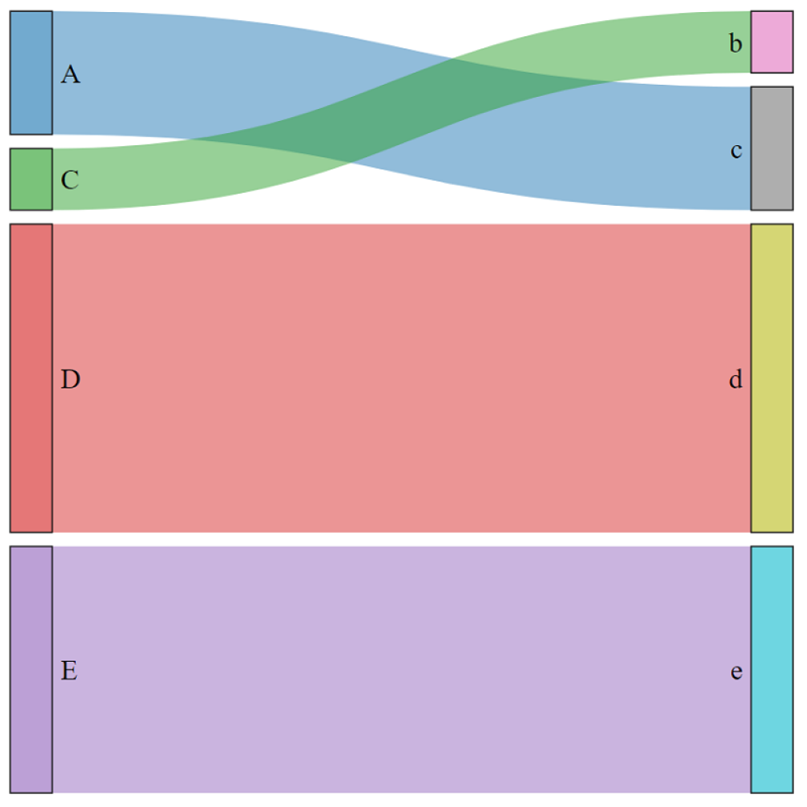
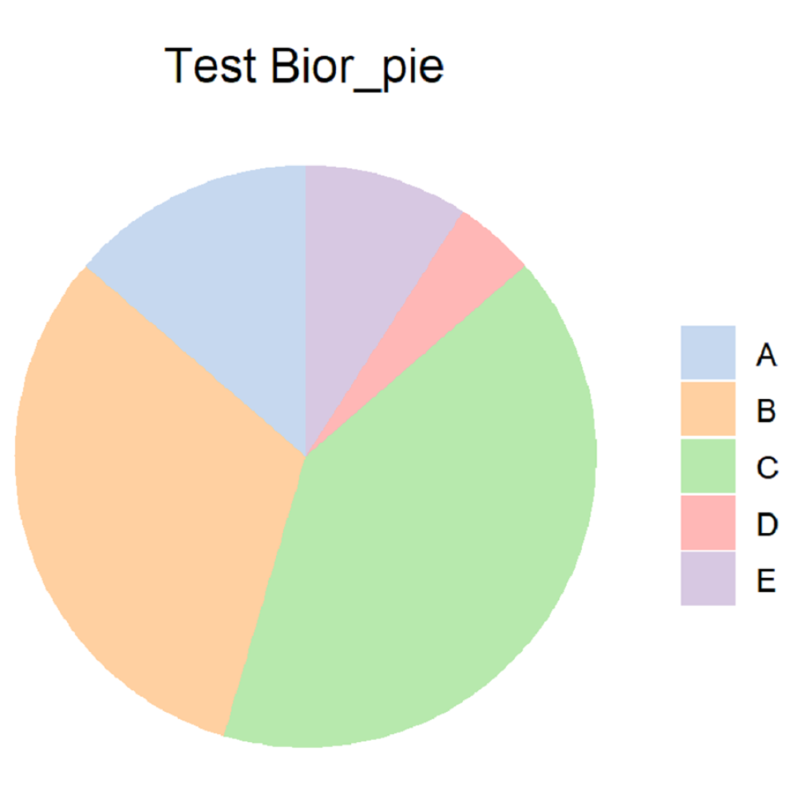
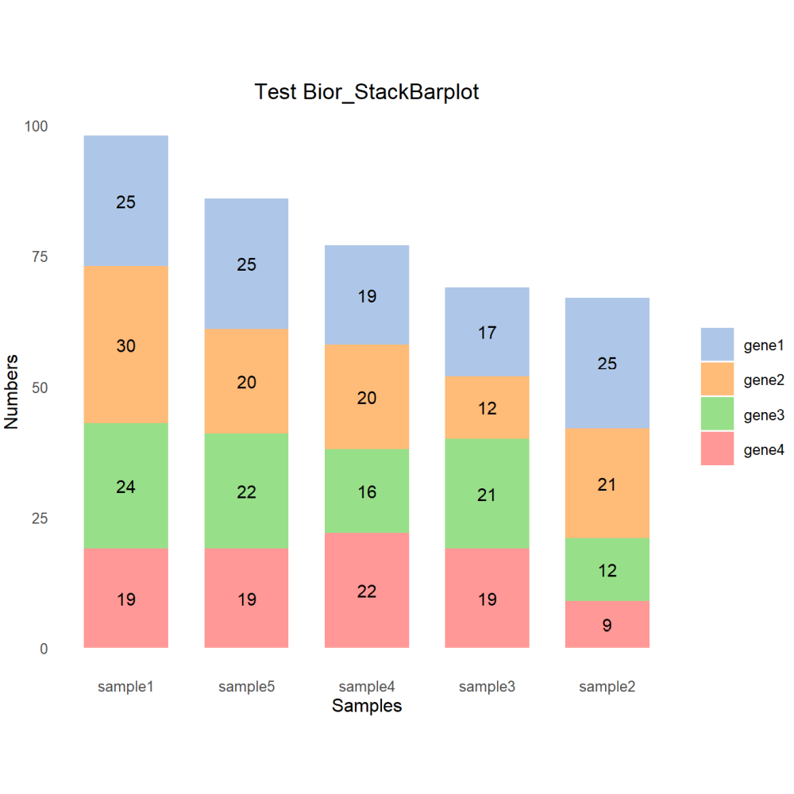

# Basic Plot 

Some basic plots commonly used

## Bior_Sankey

**Description**\
sankey plot based on networkD3::sankeyNetwork(), you can use Nodes.colour and 
Nodes.order to set Nodes colour and order, this function will automatically remove 
links$value==0 rows\
**Usage**\
Bior_Sankey(links, Nodes.colour=NULL, Nodes.order=NULL, fontSize=12,nodeWidth=30, 
nodePadding=10, margin=NULL, height=600, width=600, sinksRight=TRUE)\
**Arguments**\
* links: A dataframe, colnames must have 'source' 'target' 'value'\
* Nodes.colour: Set nodes colour\
* Nodes.order: Set nodes order\
* fontSize: Set fontsize\
* nodeWidth: Set nodewidth\
* nodePadding: Set the gap size between nodes\
* margin: R margin\
* height: numeric height for the network graph's frame area in pixels\
* width: numeric width for the network graph's frame area in pixels\
* sinksRight: boolean. If TRUE, the last nodes are moved to the right border of the plot\
**Examples**\
```{r,eval = FALSE}
# first you should install and library networkD3 packages
install.packages("networkD3") 
library(networkD3)
# links data, colnames must have 'source' 'target' 'value'
links <- data.frame(
  source=c("C","A", "B", "E", "D"), 
  target=c("b","c", "a", "e", "d"), 
  value=c(1, 2, 0, 4, 5)
)
# Set Nodes order and colour
Nodes.order <- c("A", "B", "C", "D", "E", "a", "b", "c", "d", "e")
Nodes.colour <- pal_d3("category20", alpha = 0.7)(20)
p <- Bior_Sankey(links, Nodes.order=Nodes.order, Nodes.colour=Nodes.colour, fontSize=20)
p
# Use saveNetwork() to save the plot as html
saveNetwork(p,"sankey.html")
```


## Bior_pie

**Description**\
Pie plot based on ggplot\
**Usage**\
Bior_pie(x, labels, col=pal_d3("category20",alpha=0.7)(20), title="", fontsize=20, legend.key.size=1)\
**Arguments**\
* x: A vector of value\
* labels: A vector of labels for x\
* col: colour\
* title: title\
* fontsize: fontsize\
* legend.key.size: legend size\
**Examples**\
```{r,eval = FALSE}
x <- c(3,7,9,1,2)
labels <- c("A", "B", "C", "D", "E")
col <- c("#AEC7E8B2", "#FFBB78B2", "#98DF8AB2", "#FF9896B2", "#C5B0D5B2")
p <- Bior_pie(x, labels, col=col, title="Test Bior_pie")
p
```


## Bior_StackBarplot

**Description**\
Stacked Barplot based on ggplot\
**Usage**\
Bior_StackBarplot(data, x.order=NULL, type.order=NULL, col=category20, label.size=5, 
labs.x='', labs.y='', title='', legend.key.size=1, text.size=15, bar.width=0.7, 
theme=theme_bw())\
**Arguments**\
* data: A dataframe, the columns are x-axis sample, the rows are fill type\
* x.order: x axis sample order\
* type.order: fill type order\
* col:fill colours\
* label.size: label size\
* labs.x: x axis title\
* labs.y: y axis title\
* title: figure title\
* legend.key.size: legend size\
* text.size: text size\
* bar.width: bar width\
* theme: choose ggthemes, eg:theme_bw(), theme_classic()\
**Examples**\
```{r,eval = FALSE}
data <- data.frame(matrix(rnorm(20, mean = 20, sd = 5),c(4,5)))
data <- round(data)
rownames(data) <- paste('gene',1:4, sep='')
colnames(data) <- paste('sample',1:5,sep='')
x.order <- c('sample1','sample5','sample4','sample3','sample2')
type.order <- c('gene1','gene2','gene3','gene4')
col <- pal_d3("category20")(20)[11:20]
p <- Bior_StackBarplot(data, x.order=x.order, type.order=type.order, col = col,
                  labs.x='Samples', labs.y='Numbers', title='Test Bior_StackBarplot',
                  theme=theme_minimal())
p
```


