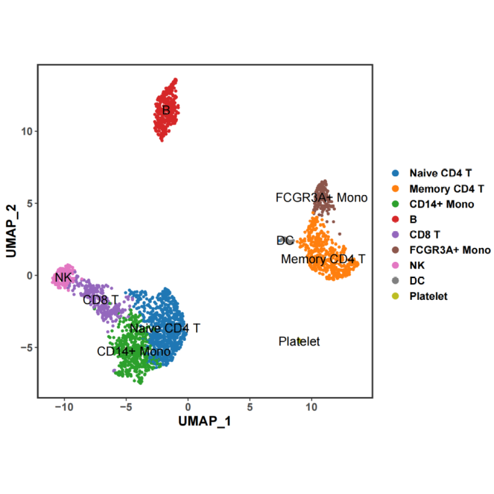
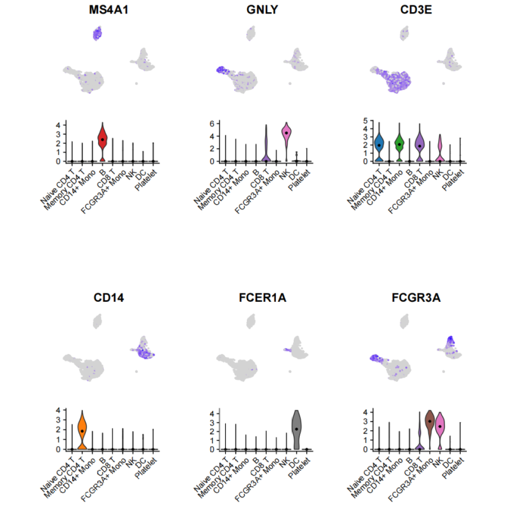
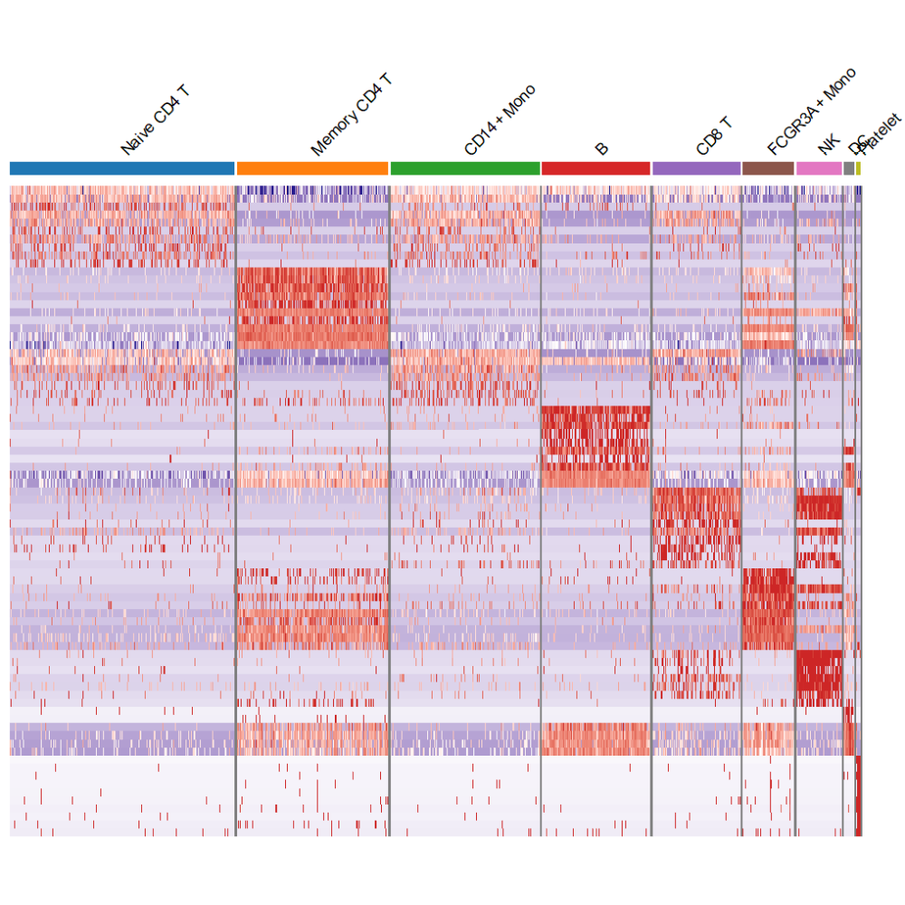

# scRNAseq Plot

Some plots commonly used in scRNAseq analysis.\
The test data used in Examples is [Seurat Tutorial Data](https://satijalab.org/seurat/archive/v3.1/pbmc3k_tutorial.html)\
```{r,eval = FALSE}
# first you should install and library Seurat packages
install.packages("Seurat") 
library(Seurat)
# load test data
seuratobject <- readRDS("testdata/pbmc3k_final.rds")
# colors
cols <- pal_d3("category20")(20)
```

## Bior_DimPlot

**Description**\
Plot based on Seurat::DimPlot()\
**Usage**\
Bior_DimPlot(seuratobject, reduction="umap", pt.size=1, label = TRUE, label.size=5, cols=NULL)\
**Arguments**\
* seuratobject: Seurat object\
* reduction: Choose "umap" or "tsne"\
* pt.size: Adjust cell point size\
* label: Whether to label the clusters\
* label.size: Sets size of labels\
* cols: colors\
**Examples**
```{r,eval = FALSE}
p <- Bior_DimPlot(seuratobject, cols = cols)
p
```


## Bior_FeatureVlnplot

**Description**\
Simultaneously plot multiple genes Featureplot and Vlnplot\
**Usage**\
Bior_FeatureVlnplot(seuratobject, genes, title.size=15, axis.text.size=10, pt.size=1, nrow=1, scale=1, cols=NULL)\
**Arguments**\
* seuratobject: Seurat object\
* genes: Multiple genes vectors, eg: c("MS4A1", "GNLY", "CD3E")\
* title.size: title gene name size\
* axis.text.size: x-axis text size\
* pt.size: Featureplot point size\
* nrow: Number of rows in the plot grid\
* scale: scale the size of all or select plots\
* cols: Vlnplot cluster colors\
**Examples**\
```{r,eval = FALSE}
genes <- c("MS4A1", "GNLY", "CD3E", "CD14", "FCER1A", "FCGR3A")
p <- Bior_FeatureVlnplot(seuratobject, genes, scale=0.8, pt.size=0.5, nrow=2, cols=cols)
p
```


## Bior_DoHeatmap

**Description**\
Plot based on Seurat::DoHeatmap()\
**Usage**\
Bior_DoHeatmap(seuratobject, features, group.by="ident", group.bar=TRUE, 
group.colors=NULL, group.size=5, group.label=TRUE, gene.size=5, gene.label=TRUE, 
margin=margin(0,0,0,0))\
**Arguments**\
* seuratobject: Seurat object\
* features: A vector of top genes\
* group.by: A vector of variables to group cells by; pass 'ident' to group by cell identity classes\
* group.bar: Add a color bar showing group status for cells\
* group.colors: Colors to use for the color bar\
* group.size: Size of text above color bar\
* group.label: Label the cell identies above the color bar\
* gene.size: gene label size\
* gene.label: whether to show gene label\
* margin: R margin\
**Examples**\
```{r,eval = FALSE}
library(dplyr)
pbmc.markers <- FindAllMarkers(seuratobject, only.pos = TRUE, min.pct = 0.25, logfc.threshold = 0.25)
top10 <- pbmc.markers %>% group_by(cluster) %>% top_n(n = 10, wt = avg_log2FC)
p <- Bior_DoHeatmap(seuratobject, top10$gene, group.colors=cols, group.size=3, gene.label=F,  margin=margin(20,20,0,0))
p
```


